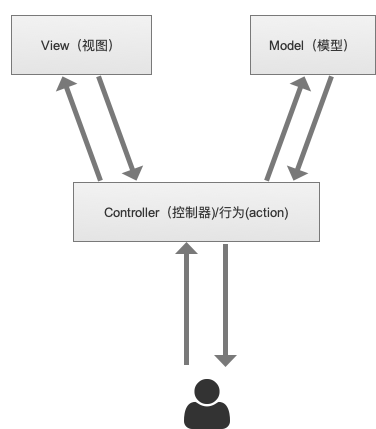

# ToDoList

## 适合人群
- 热爱编程
- 掌握基本HTML/CSS/JavaScript
- 掌握常见的ES6语法:async函数,扩展运算,class等
- 掌握常见NodeJs API,了解异步处理方法
- 了解Http/Ajax
- 最好有过WEB开发经验

## 你将收获
- 基于NodeJs搭建一个简单的WEB服务器
- 前后台交互
- MVC以及NodeJs实现一个小型MVC框架
- 常用的WEB开发技巧

## 计划

### Day1

- WEB运行原理介绍 [MDN参考](https://developer.mozilla.org/zh-CN/docs/Learn/Getting_started_with_the_web/How_the_Web_works)

- 用NodeJs搭建WEB服务器
    - NodeJs介绍和安装,参考[NodeJs官网](http://www.nodejs.org)
    - WEB服务器程序开发
    - [NodeJs中文文档参考](http://www.nodejs.cn)
- NodeJs文件处理,文件的读写(异步) 

### Day2 

- 处理静态资源,响应头mimeType的设置[MDN mime type参考](https://developer.mozilla.org/zh-CN/docs/Web/HTTP/Basics_of_HTTP/MIME_types)

- TodoList项目静态页面开发

### Day3 
- 发送ajax
- 路由处理
- 模块化,获取数据方法封装
- NodeJs模版处理,[swig模版](https://github.com/paularmstrong/swig)使用
- 显示项目列表

### Day4
- 添加/删除项目
    - 客户端发送ajax
    - 服务端处理文件并返回结果
    - 客户端操作DOM

### Day 5
- MVC介绍

    MVC是一种软件开发模型,主要思想是将业务逻辑按职责分离

    - M(Model),模型,数据相关的操作和封装
    - V(View),视图,数据的展示,页面渲染
    - C(Controller),控制器,一组行为(action)的集合

- MVC 工作模式
    - 客户端用户发送请求
    - 模型框架负责路由解析,根据路由寻找对应的控制器(Controller)和行为(action)
    - 行为(action)调用相关的模型(Model)进行数据操作
    - 行为(action)根据数据操作的结果调用视图(View)进行页面的渲染,输出到客户端

- MVC重构TodoList项目

- 总结和展望

